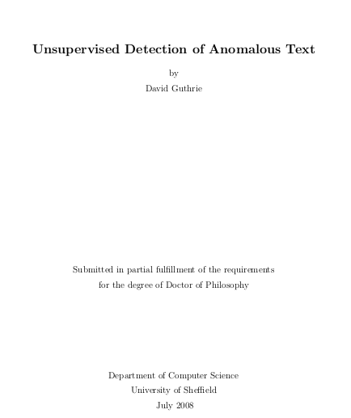
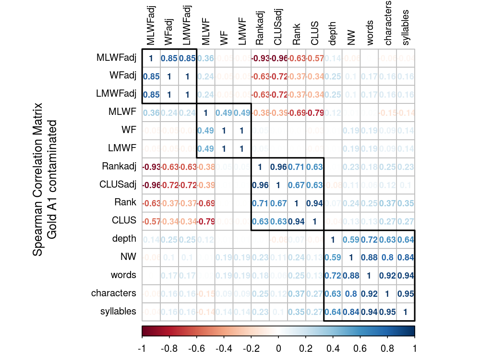

<style>
.small-code pre code {
  font-size: 1em;
}
</style>

Sentence outlier detection
========================================================
author: Magdiel Ablan
date: 04-10-2017
autosize: true

Outline
========================================================

- Introduction
- Stahel-Donoho Estimator (SDE)
- PCout method
- Test data sets
- Data set simplification
- Using SDE
- Using PCout
- Conclusion
- Further work

Introduction
========================================================
The following is a summary of the results so far of trying to adapt and implement
the ideas on: *Unsupervised Detection of Anomalous Text* by David Guthrie (2008).

 
 


The Stahel-Donoho Estimator Distance
========================================================
This method consist on calculating projections of the 
data which maximize an observations distance from the center of the observations 
. I use the implementation in R package `rrcov` (Todorov, 2016).
- This is implemented in function `SDEDist`. 
- This function receives as input a table with the stats for all the sentences
in a given story and a logical vector that indicates if the sentence is outlier. 
- It returns:
  + A vector with the distances of each sentence ordered from most likely outlier 
to less likely 
  + A flag indicating if the algorithm predicted the sentence as an outlier 
  
***
![nube] (nube.png)


The PCOut method 
========================================================
This method identify multivariate outliers in high dimensional data sets by 
measuring a sentence distance from the center of the observations in principal 
component space using kurtosis to weight these components. The implementation I 
use is in the R package `mvoutlier` (Filzmoser, 2017)
- This is implemented in function `PCDist`.
- Uses the same input and outputs as before


Test data sets
========================================================
- I use the **The Gold Rush** set of stories and **Earthquake Exemplar**.
- The process is as follows:
  + Take the sentences of level A1 story 
  + Add one sentence of the same story set taken from the A6 or another higher level 
  + This sentence was chosen because it is noticeable different in terms of 
  parse tree depth or number and frequency of words
- This first attempt has four cases, two for each set of stories
***

![test_data] (test_data.png)


Example using the Gold Rush series (1)
========================================================
class: small-code
For one of the cases, the sentence added to the level 1 story was:


```
[1] "They disagreed about whether to tell people about the gold, since Sutter intended to use the land for agriculture."
```
that has the following stats:

|    | depth| words| characters| syllables| NW|      WF| WFadj|    Rank| Rankadj| MLWF| MLWFadj| LMWF| LMWFadj| CLUS| CLUSadj|
|:---|-----:|-----:|----------:|---------:|--:|-------:|-----:|-------:|-------:|----:|-------:|----:|-------:|----:|-------:|
|157 |    18|    19|         96|        30| 18| 4128695| 85334| 1192.78| 2362.44| 5.61|    4.63| 6.62|    4.93|    1|       2|


Example using the Gold Rush series (2)
========================================================
class: small-code
Compared to the first sentences of the A1 story:


```
[1] "The California Gold Rush was in the 1800s."
[2] "California is in the United States.       "
[3] "It is in the west.                        "
[4] "In 1849, there was gold in California.    "
```
that has the following stats:

| depth| words| characters| syllables| NW|       WF|   WFadj|   Rank| Rankadj| MLWF| MLWFadj| LMWF| LMWFadj| CLUS| CLUSadj|
|-----:|-----:|----------:|---------:|--:|--------:|-------:|------:|-------:|----:|-------:|----:|-------:|----:|-------:|
|     6|     8|         35|         9|  6| 10287817| 21506.0| 990.67|  2961.5| 6.11|    4.23| 7.01|    4.33| 0.83|     2.5|
|     6|     6|         30|         9|  5|  7499188| 45490.5| 440.20|  1092.5| 6.04|    4.63| 6.88|    4.66| 0.60|     1.5|
|     6|     5|         14|         5|  5|  8385121| 67220.0| 126.40|   607.0| 6.48|    4.83| 6.92|    4.83| 0.20|     1.0|
|     7|     7|         32|         8|  5|  4077278| 34928.0| 270.00|  1270.0| 6.17|    4.54| 6.61|    4.54| 0.40|     2.0|


Data set simplification
========================================================
There is a great deal of correlation between these variables:




A minimalist Data set 
========================================================
The methods require independence of the variables so only
the following variables were kept:

- depth

- words

- WF

- Rank


Confusion matrix (1)
========================================================

https://en.wikipedia.org/wiki/Confusion_matrix

![confusion] (confusion1.png)
![confusuion 2] (confusion2.png)


Confusion matrix (2)
========================================================
![confusion 2] (masconfusion.png)


Using SDE y PCDist 
========================================================
class: small-code
left: 50%

- SDE:

```
Confusion Matrix and Statistics

       prediction
truth   TRUE FALSE
  TRUE     4     0
  FALSE   35    81
                                          
               Accuracy : 0.7083          
                 95% CI : (0.6184, 0.7877)
    No Information Rate : 0.675           
    P-Value [Acc > NIR] : 0.2496          
                                          
                  Kappa : 0.1337          
 Mcnemar's Test P-Value : 9.081e-09       
                                          
            Sensitivity : 0.10256         
            Specificity : 1.00000         
         Pos Pred Value : 1.00000         
         Neg Pred Value : 0.69828         
             Prevalence : 0.32500         
         Detection Rate : 0.03333         
   Detection Prevalence : 0.03333         
      Balanced Accuracy : 0.55128         
                                          
       'Positive' Class : TRUE            
                                          
```

***
- PCDist:


```
Confusion Matrix and Statistics

       prediction
truth   TRUE FALSE
  TRUE     4     0
  FALSE   31    85
                                          
               Accuracy : 0.7417          
                 95% CI : (0.6538, 0.8172)
    No Information Rate : 0.7083          
    P-Value [Acc > NIR] : 0.2433          
                                          
                  Kappa : 0.1545          
 Mcnemar's Test P-Value : 7.118e-08       
                                          
            Sensitivity : 0.11429         
            Specificity : 1.00000         
         Pos Pred Value : 1.00000         
         Neg Pred Value : 0.73276         
             Prevalence : 0.29167         
         Detection Rate : 0.03333         
   Detection Prevalence : 0.03333         
      Balanced Accuracy : 0.55714         
                                          
       'Positive' Class : TRUE            
                                          
```

Conclusions 
========================================================
- Promising results, considering it is not a fully automated process
- For this test set, PCDist functions slightly better than SDE

Further work 
========================================================
- Improvements on performance using scaling
- Outliers only in one direction
- Optimizing the threshold 
- Building a database of training an test cases

             
========================================================
<style>

p#myPara{
  color: steelblue;
  font-family: garamond;
  font-size: 1.5em;
}

</style>


<h1> Is it worth to keep pursuing this path? </h1>


